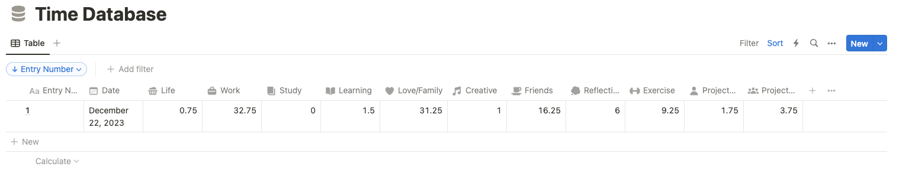

<h1 align="center"> NCal </h1>
<p>
  
  <a href="https://github.com/vectara/vectara-ingest#readme" target="_blank">
    
  </a>
  <a href="https://github.com/vectara/vectara-ingest/graphs/commit-activity" target="_blank">
    
  </a>
  <a href="https://twitter.com/kevinychou" target="_blank">
    
  </a>
</p>

`Google Calendar to Notion sync`

<p align="center">
  
</p>

# About this project
If you're like me, you're obssessed with two things - Google Calendar and Notion. However, there isn't an easy way to visualise the time you spend on various things - hence the goal of this project is to sync this information into a Notion database, where you can more easily see trends in your data over time.

*Aside*: I believe future knowledge management systems will find better ways to integrate the calendar with all our other productivity tools.

This project had two goals:
- Create a useful app that is useful for tracking, personal reflections, allowing me to track how my time is being used week-to-week
- Get practice using Notion/GCal API to build something + a fun personal coding project to keep me up to scratch with Python.

For more information on this project, please see: https://kevinychou.notion.site/Project-NCal-4808de8d50c8471ab225f22ff96f6535?pvs=4

## Setup
To run this repo, you need a bit of setup: See these helpful links
- Google Calendar API Project: https://developers.google.com/calendar/api/quickstart/python
- Notion API: https://developers.notion.com/docs/create-a-notion-integration

## Usage
There are three input .json files you need in order to run the script. I've included examples of each in the git repo under /json_examples
- calendar.json: This holds the specific colour mappings you have, and the requisite column name in Notion.
- credentials.json: This is the Google API credentials given to you via creating a Google Cloud app.
- variables.json: This is the list of calendars you want to find events from, the Notion database ID you want to pull from, and your created Notion secret from the Notion API.

```
python main.py --start-date=XX-XX-XXXX --end-date==XX-XX-XXXX
```

## Upcoming Features
- [X] Implement CRON job to automate running this script at the end of every week
  - cron.sh details how this is run each week. This is setup by using "crontab -e", with a script like "30 22 * * 7" (run every Sunday at 1030PM).
  - Note: This was very frustating to setup on MacOS. Will write up how to do this in the future.
- [X] Added option to have custom flags to specify start and end date.
- [ ] Add options for more tracking via event name as opposed to just event colour
- [ ] Take "description" from Google Calendar events, and use this metadata to populate other databases (i.e. I also track my gym workouts using GCal).